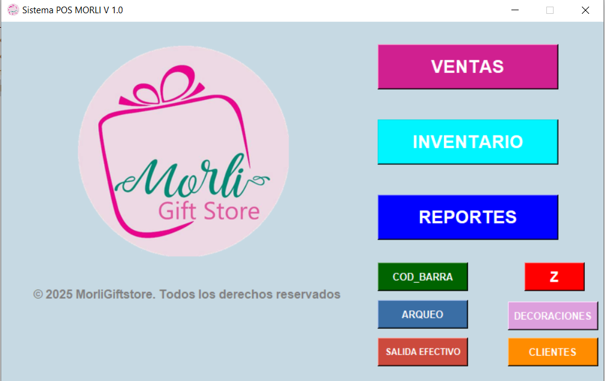
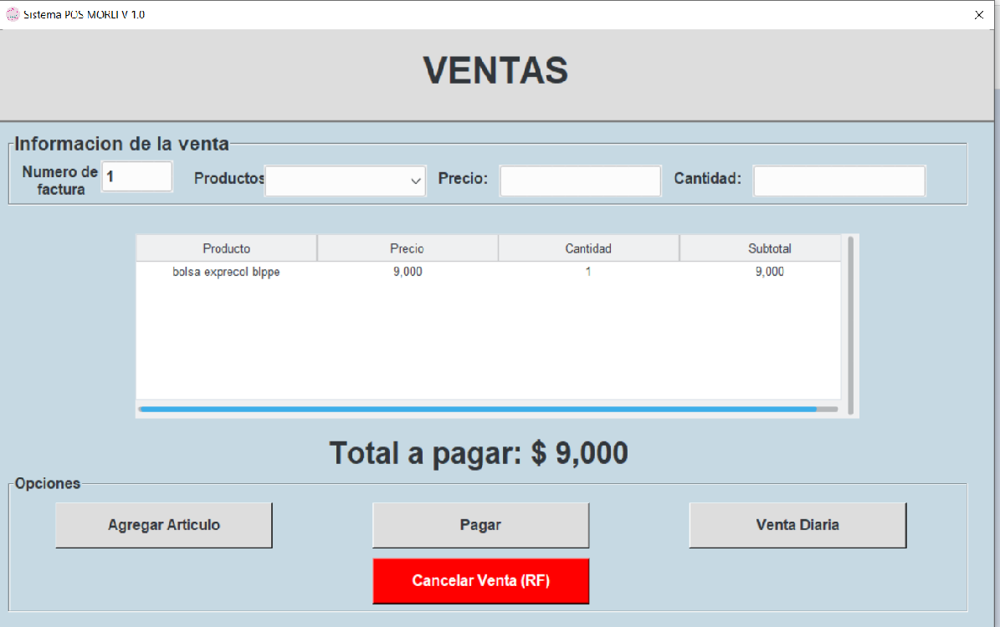
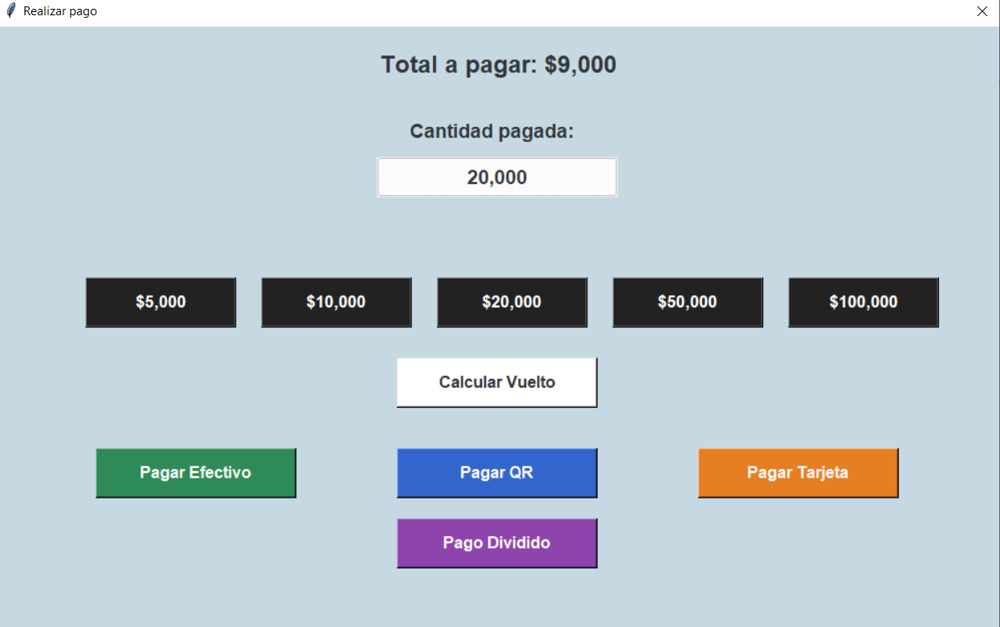
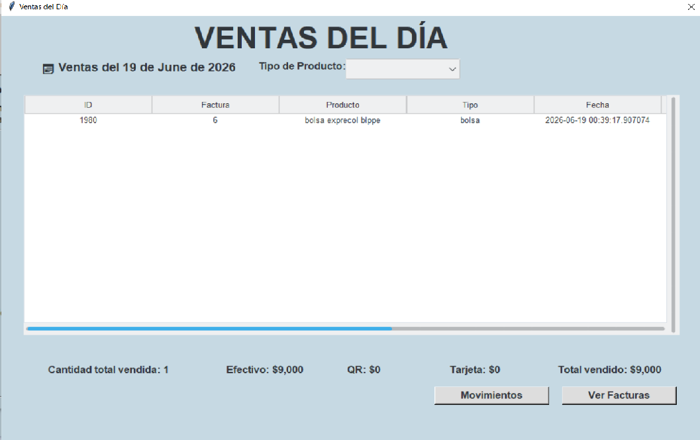
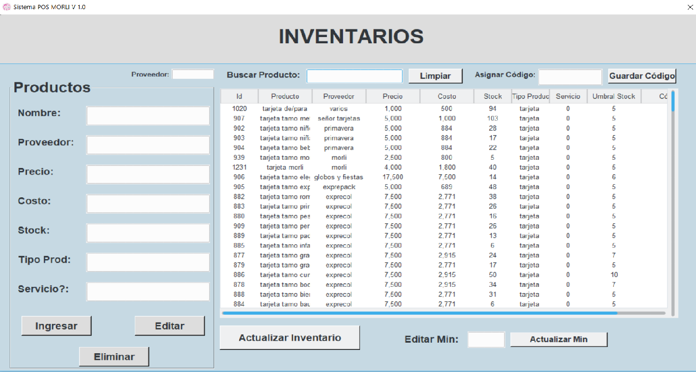
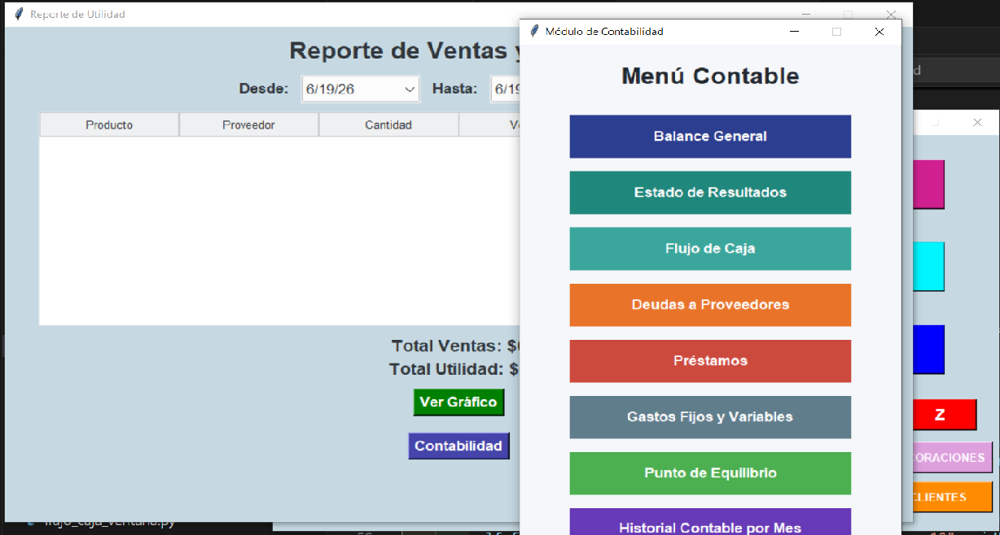

# Professional POS System
## Description
Point of sale (POS) system for the complete management of a gift shop. It allows registering sales with a barcode scanner, controlling inventory, managing customers, creating gift baskets/decorations, generating invoices, and printing tickets on a thermal printer. It includes a full accounting module with reports for profit, cash flow, income statement, balance sheet, and more.

## Technologies Used

- Python
- Tkinter (graphical interface)
- SQLite (local database)
- ReportLab (invoice and label generation in PDF)
- win32print (POS thermal printing and cash drawer opening)
- Matplotlib (report charts)
- Modular architecture (UI, Logic, and Utilities)

## Project Structure
```
MorliPOS/

│

├── index.py

├── manager.py

├── MorliPOS.spec

├── icono.ico

│

├── database.db

├── clientes.db

├── codigos.db

│

├── ui/

│   ├── ventas.py

│   ├── inventario.py

│   ├── container.py

│   ├── clientes.py

│   ├── anchetas.py

│   ├── movimientos_inventario.py

│   ├── prestamos_ventana.py

│   └── flujo_caja_ventana.py

│

├── logica/

│   ├── corte_z.py

│   ├── rf.py

│   ├── generar_codigo.py

│   ├── reporte_utilidad.py

│   ├── balance_general.py

│   ├── estado_resultados.py

│   ├── punto_equilibrio.py

│   ├── deudas_proveedores.py

│   ├── gastos.py

│   └── historial_contable_mes.py

│

├── utils/

│   └── impresora_pos_profesional.py

│

├── imagenes/

│   └── logo e imágenes del sistema

│

├── facturas/

├── corte_z/

└── codigos/

└── evidencias/
```
## Technical explanation

The system was developed using Python with a graphical interface in Tkinter and a local SQLite database.

The project follows a modular architecture that separates responsibilities:

- **UI:** contains the system windows: sales, inventory, customers, gift baskets, inventory movements, and the accounting interface windows.
- **Logic:** contains the business operations and reports: Z-report, cancellations (RF), barcode generation, and all accounting calculations (profit, balance sheet, income statement, break-even point, etc.).
- **Utilities:** auxiliary tools such as ticket printing on the thermal printer.

The system flow is:

1. The cashier registers products using the barcode scanner or manual search.
2. At checkout, the system accepts cash, QR, card, or split payment.
3. The sale is saved to the database, stock is deducted, and the invoice is generated in PDF.
4. The ticket is printed on the thermal printer and, if payment is in cash, the cash drawer opens.
5. At the end of the day, the Z-report is generated, producing the cash summary and closing the session.
6. The administrator can review profit reports, inventory, and the full accounting.

## Evidences







